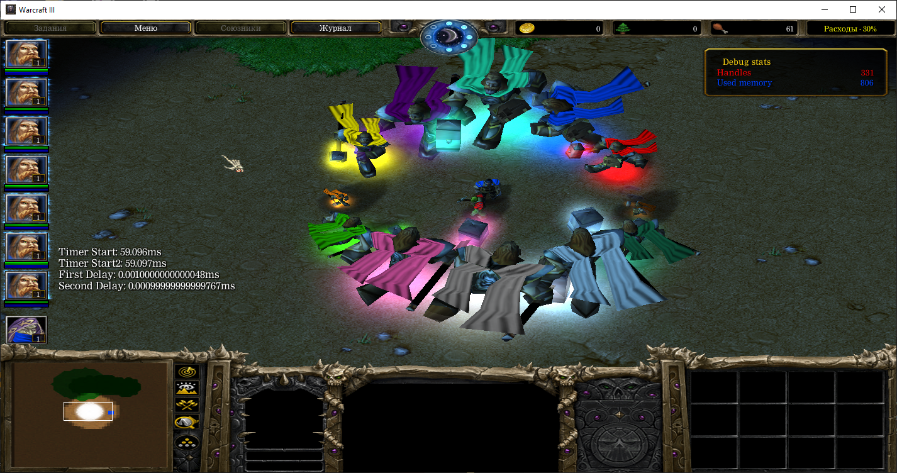
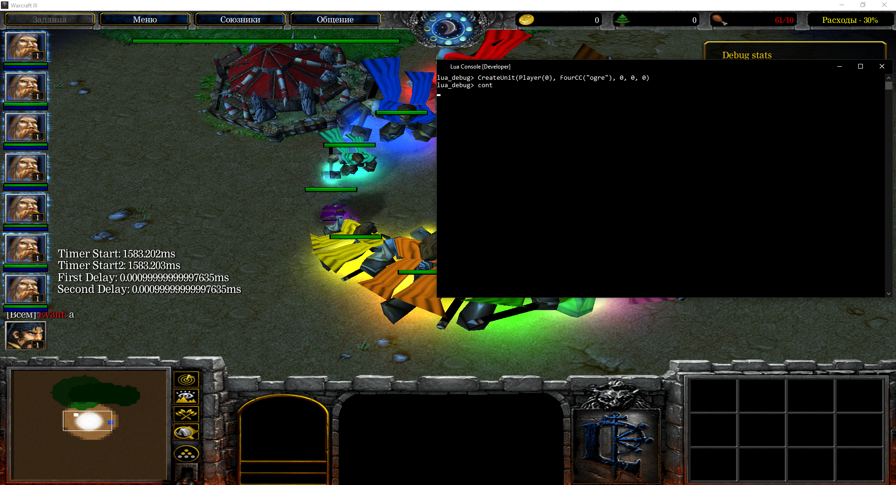
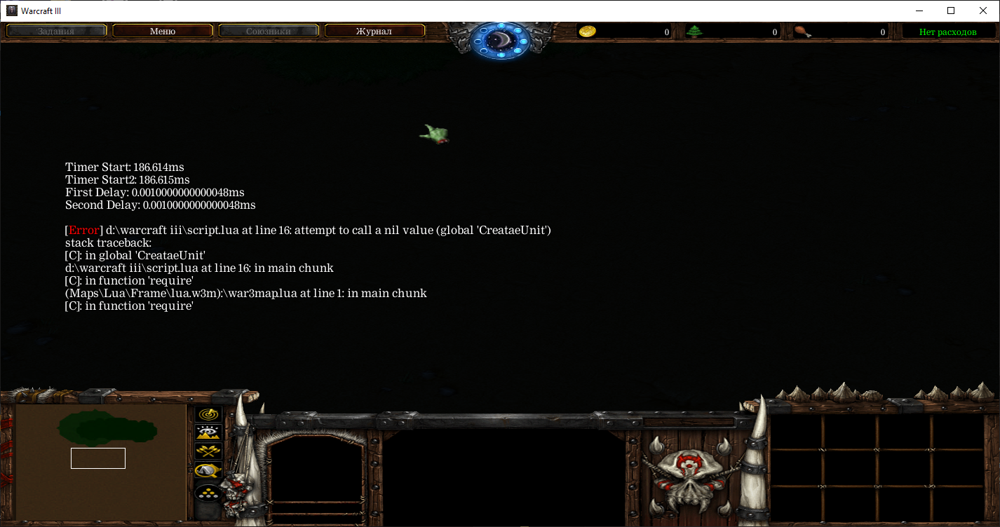
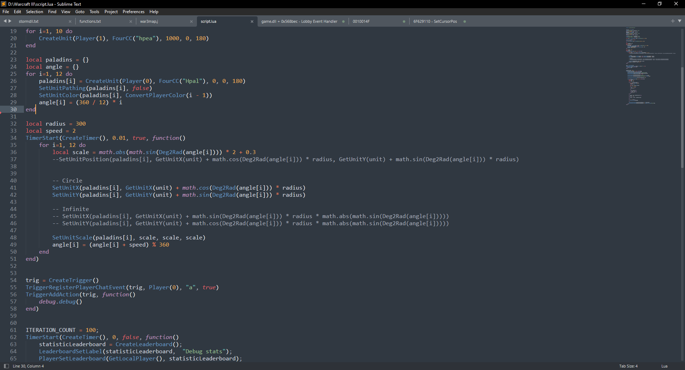

# War3 Lua - 1.3.7 (<span style="color: #53377A">Blight</span>)

[](https://www.lua.org)

[](https://github.com/Ev3nt/war3_lua/blob/master/LICENSE.md)
[](https://github.com/Ev3nt/war3_lua/network/members)

**War3 Lua** - modification that allows you to run lua scripts at the JASS level. Lua does not replace the original scripting system in the game, but only expands its capabilities.

Some natives doesn't work (thx jass for beautiful VM).


## Pictures









## Usage
Just create **war3map.lua** and move into your map. You can use fast code testing by including external script. Don't forget to use **developer mode** to unlock some features.

*war3map.lua*
```lua
require "script"
```

*script.lua*
```lua
local unit = CreateUnit(Player(0), FourCC("Hpal"), 0, 0, 0) --> Creating unit
SetUnitColor(unit, ConvertPlayerColor(1)) --> Changing color
```

If you wanna display some text, use "**print**" to type it in the chat, and "**printc**" to display text in console. Don't forget to use **console mode**.

## Example

There's a little code to showing jass leaks and memory that's being used by the **lua machine**.

```lua
local ITERATION_COUNT = 100;
TimerStart(CreateTimer(), 0, false, function()
	statisticLeaderboard = CreateLeaderboard();
	LeaderboardSetLabel(statisticLeaderboard,  "Debug stats");
	PlayerSetLeaderboard(GetLocalPlayer(), statisticLeaderboard);
	LeaderboardDisplay(statisticLeaderboard, true);

	LeaderboardAddItem(statisticLeaderboard,"Handles", 0, Player(0))
	LeaderboardAddItem(statisticLeaderboard,"Used memory", 0, Player(1))

	LeaderboardSetSizeByItemCount(statisticLeaderboard, 2);

	TimerStart(GetExpiredTimer(), 0.1, true, function()
		local result = 0
		local min = -1
		local locs = {}

		for i = 1, ITERATION_COUNT do
			local loc = Location(0, 0)
			locs[i] = loc
	      
	       	local id = GetHandleId(loc)
	       	id = id - 0x100000

	       	if min == -1 then
				min = id
			end
			
			if id > result then
				result = id
			elseif id < min then
				min = id
			end
		end

		if result - min > ITERATION_COUNT then
			result = min
		else
			result = result - ITERATION_COUNT
		end

		for i = 1, #locs do
			RemoveLocation(locs[i])
		end

		LeaderboardSetItemValue(statisticLeaderboard, 0, R2I(result));
    	LeaderboardSetItemValue(statisticLeaderboard, 1, R2I(collectgarbage("count")));
	end)
end)
```

## Installation
* Move the folder Scripts, Maps and **war3_lua.mix** to the game folder
* Run the game (type "*-dev*" to activate **developer mode** and "*-console*" to use console)
* Open the map with **war3map.lua** file inside

## License

This modification is available as open source under the terms of the [MIT License](https://github.com/Ev3nt/war3_lua/blob/master/LICENSE.md).